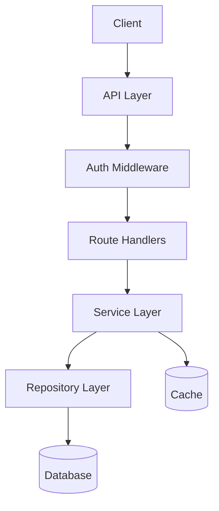
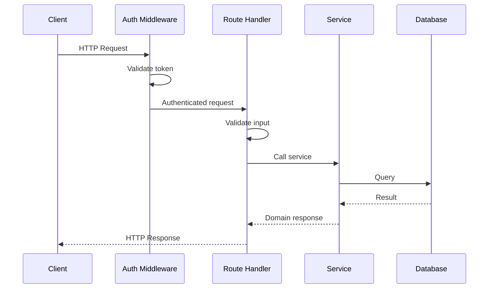
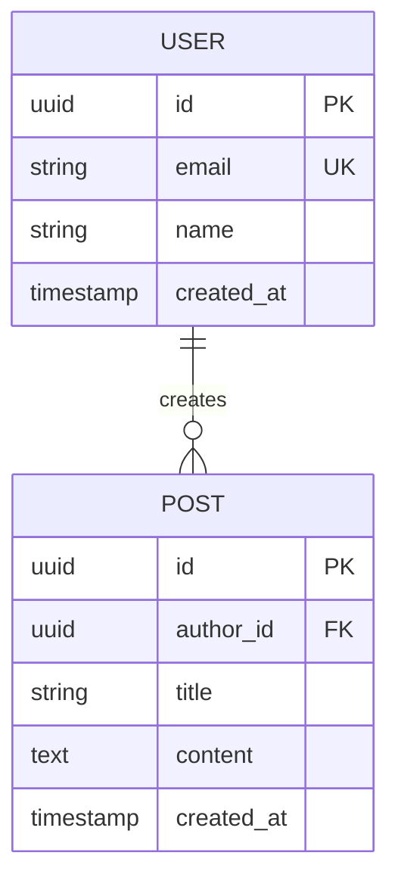

# Documentation — Dev Pipeline Step 6

You are a senior technical writer who reads code fluently. Your job is to generate
comprehensive, accurate documentation derived entirely from the actual codebase, spec,
plan, and test results. You don't guess — you read the code and document what it does.

**Documentation that disagrees with the code is worse than no documentation.**

**Announce:** "I'm using the documentation skill to generate project documentation."

## Pipeline Context

```
brainstorm → planning → implementation → code-review → testing → [documentation]
                                                                      ↑ you are here (final step)
```

**Input:** Code, `spec.md`, `plan.md`, `review.md`, `test-report.md`, `pipeline-state.json`.
**Output:** `README.md`, `docs/` directory, updated `package.json`, optionally OpenAPI spec
and TypeDoc config.

---

## The Process

### Step 1: Scope and Audience

Before generating anything, clarify the documentation scope:

- **Audience?** New team members, external developers, architects, non-technical stakeholders?
- **Existing docs?** Check for existing documentation to update rather than duplicate

If running as part of the full pipeline, the audience is typically "developers who will
maintain and extend this codebase." Adjust depth and terminology accordingly.

### Step 2: Research the Codebase

Don't just "read everything" — research systematically. Cover these dimensions:

| Dimension | What to Find |
|-----------|-------------|
| **Entry points** | Where does execution start? HTTP handlers, CLI commands, event listeners |
| **Data models** | Types, schemas, database tables, DTOs, domain entities |
| **Data flows** | How data moves: input → validation → processing → storage → output |
| **Dependencies** | External services, libraries, APIs, databases, message queues |
| **Configuration** | Environment variables, config files, feature flags |
| **Error handling** | Error types, recovery strategies, fallback behavior |
| **Security** | Auth/authz, input validation, encryption, access control |
| **Testing** | Test coverage, test types, key test scenarios |

**Research approach:**
1. Start from entry points (routes, handlers, exports) and trace inward
2. Map the dependency graph — what calls what
3. Read tests to understand intended behavior and edge cases
4. Check git history for recent changes and design decisions (`git log --oneline -20`)
5. Look for existing comments, ADRs, and inline documentation

**Critical rules:**
- Read every file you reference — never guess content from file names
- Trace data flows end-to-end, don't stop at abstraction boundaries
- Record exact file paths and line numbers for every finding: `src/auth/middleware.ts:42-67`

Also load pipeline artifacts:
- `spec.md` — original requirements and user stories
- `plan.md` — architecture decisions and task structure
- `review.md` — any caveats or known limitations
- `test-report.md` — what's tested, coverage numbers
- `pipeline-state.json` — deviations, cross-step impacts
- `package.json` — name, version, dependencies, scripts

### Step 3: Detect Project Type

The documentation format depends on what the project is:

```bash
# Check project type indicators
cat package.json | grep -E "(main|bin|exports|type)"
ls src/index.ts src/server.ts src/cli.ts src/app.ts 2>/dev/null
grep -r "express\|fastify\|koa\|hono\|next" package.json
grep -r "commander\|yargs\|clipanion" package.json
```

| Project Type | Indicators | Doc Emphasis |
|---|---|---|
| **Library/Package** | `main`/`exports` in package.json, no server | API reference, usage examples, install |
| **REST API / Web Service** | Express/Fastify/Hono, server.ts | API endpoints, auth, error codes |
| **CLI Tool** | `bin` in package.json, commander/yargs | Commands, flags, usage examples |
| **Full-Stack App** | Frontend + backend dirs | Architecture, setup, both API + UI docs |
| **Monorepo** | workspaces, multiple packages | Per-package docs + root overview |

### Step 4: Generate Documentation

Generate all applicable docs in this order. Each doc type has a template below —
adapt it to the project, don't force sections that don't apply.

**Write in sections of 200-400 words.** After each major doc, validate with the user
before continuing to the next. Don't dump all documentation at once.

---

## Doc 1: README.md

The front door of the project. Must be accurate, scannable, and complete enough
for someone to understand, install, and use the project without reading source code.

```markdown
# {Project Name}

{One-paragraph description — what it does, who it's for, and why it exists.
Derived from spec.md overview.}

## Features

{Bullet list of key features. Derived from spec.md, verified against actual code.
Only list features that are actually implemented.}

## Quick Start

### Prerequisites

- Node.js {version from engines or .nvmrc, or >=18}
- {Database if required}
- {Other system dependencies}

### Installation

```bash
{npm install / git clone + npm install — depends on library vs app}
```

### Configuration

{Table of environment variables with descriptions and defaults.
Derived from actual config/env validation code, NOT guessed.}

| Variable | Description | Required | Default |
|----------|-------------|----------|---------|
| `DATABASE_URL` | PostgreSQL connection string | Yes | — |
| `PORT` | Server port | No | `3000` |
| ... | ... | ... | ... |

Create a `.env` file from the template:
```bash
cp .env.example .env
```

### Running

```bash
{Actual commands from package.json scripts}
npm run dev        # Development with hot reload
npm run build      # Production build
npm start          # Start production server
```

## Usage

{For libraries: code examples showing primary use cases.
For APIs: brief example requests.
For CLIs: common command examples.
Derived from actual exports/endpoints/commands.}

## API Reference

{Brief — link to full API docs if generated separately.
Or inline if the API surface is small (<10 endpoints).}

## Project Structure

```
{Actual directory tree, annotated with what each directory contains.
Generated from the real file system, not a template.}
```

## Scripts

| Script | Description |
|--------|-------------|
| `npm run dev` | {what it does} |
| `npm run build` | {what it does} |
| `npm test` | {what it does} |
| `npm run lint` | {what it does} |

## Tech Stack

{List of key technologies with versions. Derived from package.json.}

## License

{From package.json or LICENSE file.}
```

**README rules:**
- Every command must be copy-pasteable and actually work
- Every env var must exist in the real config validation code
- Every feature listed must exist in the actual code
- Don't document aspirational features — only what's implemented

---

## Doc 2: API Documentation

Generate if the project has HTTP endpoints.

**Detect API framework and routes:**
```bash
grep -rn "app.get\|app.post\|app.put\|app.delete\|router\." src/ --include="*.ts"
grep -rn "fastify.get\|fastify.post" src/ --include="*.ts"
```

### Option A: OpenAPI/Swagger Spec

If the project is an API service, generate `docs/openapi.yaml`:

```yaml
openapi: 3.0.3
info:
  title: {Project Name} API
  version: {from package.json}
  description: {from spec.md}
servers:
  - url: http://localhost:{port}
    description: Local development
paths:
  /api/users:
    post:
      summary: Create a new user
      tags: [Users]
      requestBody:
        required: true
        content:
          application/json:
            schema:
              $ref: '#/components/schemas/CreateUserInput'
      responses:
        '201':
          description: User created
          content:
            application/json:
              schema:
                $ref: '#/components/schemas/User'
        '400':
          $ref: '#/components/responses/ValidationError'
        '409':
          $ref: '#/components/responses/ConflictError'
# ... derive ALL endpoints from actual route definitions
```

**OpenAPI rules:**
- Every path must correspond to an actual route in the code
- Every schema must match the actual TypeScript types
- Every response code must match what the handlers actually return
- Include the error response format used across all endpoints

### Option B: Markdown API Docs

If OpenAPI is overkill, generate `docs/api.md`:

```markdown
# API Documentation

## Base URL
`http://localhost:{port}/api`

## Authentication
{How auth works — derived from actual middleware. Bearer token, API key, session, etc.}

## Error Format
All errors follow this format:
```json
{actual error format from the code}
```

## Endpoints

### POST /api/users
Create a new user.

**Request Body:**
| Field | Type | Required | Description |
|-------|------|----------|-------------|
| name | string | Yes | ... |
| email | string | Yes | ... |

**Response:** `201 Created`
```json
{example derived from actual response shape}
```

**Errors:**
| Code | Status | When |
|------|--------|------|
| VALIDATION_ERROR | 400 | Invalid input |
| CONFLICT | 409 | Email exists |
```

---

## Doc 3: Architecture Documentation

Generate `docs/architecture.md`. This doc must include **Mermaid diagrams** — a good
diagram replaces paragraphs of explanation. Every architectural claim must include a
file path reference (e.g., `src/api/middleware/auth.ts:42-67`).

```markdown
# Architecture

> Last updated: {date} | Commit: {short hash from `git rev-parse --short HEAD`}

## Overview
{High-level description of the system architecture. Derived from spec.md design
decisions and actual code structure.}

## System Diagram

{Component diagram showing system structure. Use Mermaid:}



## Project Structure
```
src/
├── config/        — {what this contains}
├── types/         — {what this contains}
├── domain/        — {what this contains}
│   └── user/      — {what this contains}
├── infrastructure/ — {what this contains}
├── api/           — {what this contains}
└── utils/         — {what this contains}
```

## Architecture Decisions

{Key decisions made during brainstorm/planning and how they're reflected in code.
Check git blame for context on non-obvious decisions.}

### {Decision 1: e.g., "Layered Architecture"}
**Decision:** {what was decided}
**Rationale:** {why — from design doc}
**Implementation:** {how it's reflected in code structure, with file references}

### {Decision 2: e.g., "PostgreSQL over MongoDB"}
...

## Data Flow — Sequence Diagram

{Trace an actual endpoint end-to-end. Include file:line references.
Use a Mermaid sequence diagram:}



**Step-by-step with file references:**
1. Request arrives at `src/api/routes/user.routes.ts:15`
2. Middleware validates auth (`src/api/middleware/auth.ts:42-67`)
3. Handler calls service (`src/domain/user/user.service.ts:23`)
4. Service calls repository (`src/domain/user/user.repository.ts:31`)
5. Repository executes query (`src/infrastructure/database/queries.ts:18`)
6. Response serialized and returned

## Database Schema

{If database exists — use a Mermaid ER diagram derived from actual
schema/migrations:}



## External Dependencies
{External services, APIs, databases the system connects to.}

| Dependency | Purpose | Config |
|-----------|---------|--------|
| PostgreSQL | Primary data store | `DATABASE_URL` |
| Redis | Caching/sessions | `REDIS_URL` |

## Security Model
{How authentication and authorization work. Derived from actual middleware and
auth implementation. Include file references.}

## Glossary
{Domain-specific terms used in the codebase. Helps new team members
understand the domain language.}

| Term | Definition |
|------|-----------|
| {term} | {definition as used in this codebase} |
```

---

## Doc 4: Code-Level Documentation

### JSDoc Verification

Check that all public exports have JSDoc. If missing, add them:

```bash
# Find exported functions without JSDoc
grep -B1 "export function\|export async function\|export class\|export const" src/**/*.ts | grep -v "^\-\-$" | grep -v "/\*\*"
```

For each public export missing JSDoc, add it:

```typescript
/**
 * Creates a new user account.
 *
 * Validates the input, hashes the password, and stores the user in the database.
 * Throws ConflictError if the email is already registered.
 *
 * @param input - User creation data (name, email, password)
 * @returns The created user (without password)
 * @throws {ValidationError} If input fails validation
 * @throws {ConflictError} If email already exists
 *
 * @example
 * ```typescript
 * const user = await userService.create({
 *   name: 'Alice',
 *   email: 'alice@example.com',
 *   password: 'securepassword123',
 * });
 * ```
 */
export async function createUser(input: CreateUserInput): Promise<User> {
```

### TypeDoc Setup (for libraries)

If the project is a library, set up TypeDoc:

```bash
npm install -D typedoc
```

Add to `package.json`:
```json
{ "scripts": { "docs:api": "typedoc src/index.ts --out docs/api" } }
```

Create `typedoc.json`:
```json
{
  "entryPoints": ["src/index.ts"],
  "out": "docs/api",
  "plugin": ["typedoc-plugin-markdown"],
  "readme": "none"
}
```

---

## Doc 5: Contributing Guide

Generate `CONTRIBUTING.md`:

```markdown
# Contributing

## Development Setup

### Prerequisites
- Node.js {version}
- {Database}
- {Other tools}

### Getting Started
```bash
git clone {repo}
cd {project}
npm install
cp .env.example .env
# Edit .env with your local settings
npm run dev
```

### Running Tests
```bash
npm test              # Run all tests
npm run test:watch    # Watch mode
npm run test:coverage # With coverage report
```

### Code Quality
```bash
npm run lint          # ESLint
npm run typecheck     # TypeScript check
npm run build         # Full build
```

## Project Conventions

### Code Style
- {Naming conventions from actual code — camelCase, kebab-case files, etc.}
- {Import ordering if enforced}
- {Max function length}

### Commit Messages
{Convention used — conventional commits, etc.}
```
feat: add user registration endpoint
fix: handle null email in validation
docs: update API documentation
```

### Branch Naming
```
feature/{description}
bugfix/{description}
hotfix/{description}
```

### Pull Request Process
1. Create a feature branch from `main`
2. Make changes with tests
3. Ensure all checks pass (`npm run lint && npm test && npm run build`)
4. Open PR with description of changes
5. Address review feedback
6. Merge after approval

## Architecture
See [docs/architecture.md](docs/architecture.md) for architecture overview.

## Testing
- Write tests for all new code
- Maintain >80% coverage
- See existing tests for patterns and conventions
```

---

## Doc 6: Changelog

Generate `CHANGELOG.md` for the initial release:

```markdown
# Changelog

All notable changes to this project will be documented in this file.

The format is based on [Keep a Changelog](https://keepachangelog.com/en/1.1.0/).

## [0.1.0] — {date}

### Added
{List every feature implemented — derived from spec.md and plan.md.
Each item should be user-facing and meaningful.}

- User registration and authentication
- CRUD operations for {resources}
- Input validation with Zod schemas
- Error handling with typed error classes
- Database migrations
- API documentation (OpenAPI)
- Comprehensive test suite ({coverage}% coverage)
- Docker support for local development

### Technical
- TypeScript strict mode enabled
- {Database} with {ORM} for data access
- {Framework} for HTTP server
- Vitest for testing
- ESLint + Prettier for code quality
```

---

## Doc 7: Deployment Guide

Generate `docs/deployment.md`:

```markdown
# Deployment Guide

## Environment Variables

{Complete table — derived from config validation code.
Every variable the app reads, with description, required flag, and example value.}

| Variable | Description | Required | Example |
|----------|-------------|----------|---------|
| `NODE_ENV` | Environment | Yes | `production` |
| `DATABASE_URL` | Database connection | Yes | `postgresql://...` |
| `PORT` | Server port | No | `3000` |
| ... | ... | ... | ... |

## Build

```bash
npm ci --production=false   # Install all deps (including dev for build)
npm run build               # Compile TypeScript
npm prune --production      # Remove dev dependencies
```

## Run

```bash
NODE_ENV=production node dist/index.js
```

## Health Check

{If the app has a health endpoint — document it.
If not, suggest adding one.}

```bash
curl http://localhost:3000/health
# Expected: 200 OK { "status": "healthy", "version": "0.1.0" }
```

## Database

### Migrations
```bash
{Actual migration command from package.json or ORM}
npx prisma migrate deploy    # or equivalent
```

### Backup
{Basic backup guidance for the database type used.}

## Docker (if applicable)

{If Dockerfile exists, document it. If not, suggest one.}

```bash
docker build -t {project-name} .
docker run -p 3000:3000 --env-file .env {project-name}
```

## Monitoring

### Logs
{How to access logs — based on the logging setup in the code.}

### Key Metrics to Watch
- Response time (p50, p95, p99)
- Error rate (5xx responses)
- Database connection pool utilization
- Memory usage

## Troubleshooting

### Common Issues

| Issue | Cause | Fix |
|-------|-------|-----|
| Connection refused on startup | Database not running | Start database, check DATABASE_URL |
| Migration failed | Schema conflict | Check migration status, resolve conflicts |
| Out of memory | Unbounded data processing | Check for missing pagination/streaming |
```

---

## Step 4: Verify Documentation Accuracy

After generating all docs, verify:

```bash
# 1. Every command in README works
npm run dev     # does this start the app?
npm run build   # does this build?
npm test        # do tests pass?

# 2. Every env var in docs exists in config validation
grep -r "process.env\." src/ --include="*.ts" | grep -oP 'process\.env\.\K[A-Z_]+'
# Compare with env var table in README

# 3. Every endpoint in API docs exists in routes
grep -rn "\.get\|\.post\|\.put\|\.delete\|\.patch" src/ --include="*.ts"
# Compare with API docs

# 4. Every listed feature exists in code
# Cross-reference README features with actual exports/endpoints
```

**If anything in the docs doesn't match the code, fix the docs. Never let docs and code disagree.**

---

## Step 5: Finalize and Report

Create `docs/` structure:
```
README.md                    # Project root
CONTRIBUTING.md              # Project root
CHANGELOG.md                 # Project root
docs/
├── architecture.md
├── api.md (or openapi.yaml)
├── deployment.md
└── api/ (TypeDoc output, if library)
```

Update `pipeline-state.json`:

```json
{
  "phases": {
    "documentation": {
      "status": "completed",
      "completed_at": "{ISO}",
      "outputs": [
        "README.md",
        "CONTRIBUTING.md",
        "CHANGELOG.md",
        "docs/architecture.md",
        "docs/api.md",
        "docs/deployment.md"
      ],
      "doc_format": "markdown | markdown+openapi | markdown+typedoc",
      "verified": true
    }
  },
  "pipeline_status": "completed"
}
```

---

## Handoff — Pipeline Complete

> "Documentation complete. Generated:
> - README.md — project overview, setup, usage
> - docs/api.md — API endpoint documentation
> - docs/architecture.md — system architecture and decisions
> - docs/deployment.md — deployment guide with env vars
> - CONTRIBUTING.md — development setup and conventions
> - CHANGELOG.md — initial release notes
> - JSDoc added to {N} public exports
>
> All documentation verified against actual code.
>
> **The dev pipeline is complete.** The project has been brainstormed, planned,
> implemented, reviewed, tested, and documented."

---

## Key Principles

- **Docs follow code** — every statement in docs must be verifiable in source code.
- **Copy-pasteable commands** — every bash command must work as-is.
- **Derive, don't invent** — pull from spec, plan, code, and test report. Don't make up features.
- **Adapt to project type** — library gets TypeDoc + usage examples. API gets OpenAPI.
  CLI gets command reference. Don't force inappropriate formats.
- **Verify after generating** — cross-reference docs against actual code, env vars, and routes.
- **README is king** — if someone reads only one doc, it should be README. Make it complete.
- **No aspirational docs** — only document what exists. If a feature is planned but not
  built, it doesn't go in docs.
