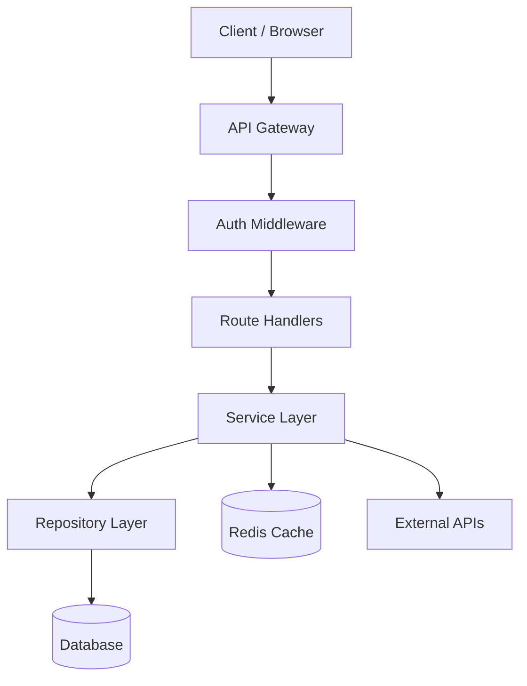
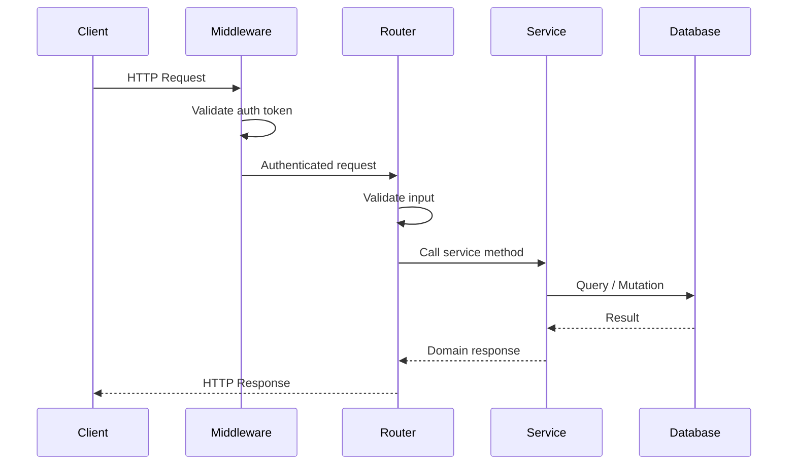
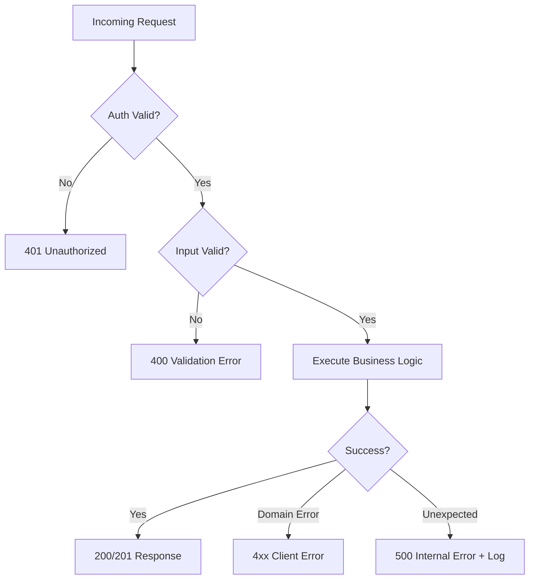
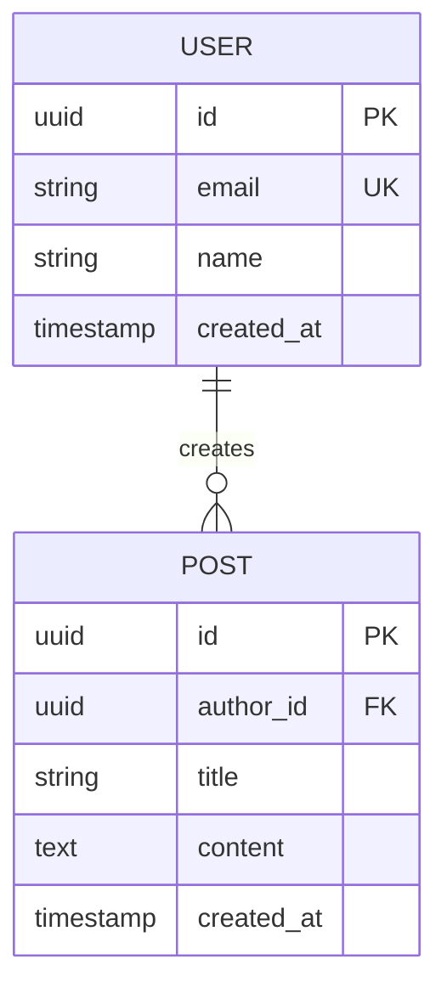
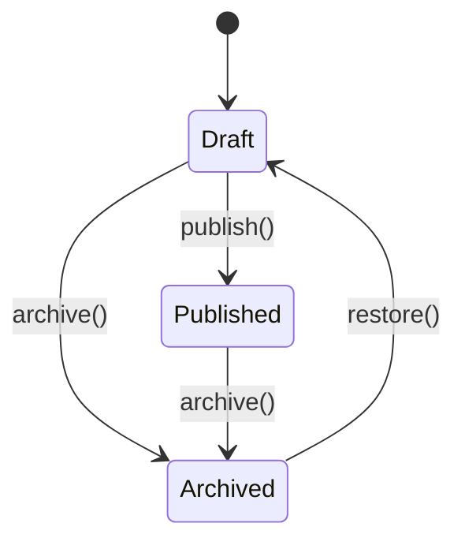
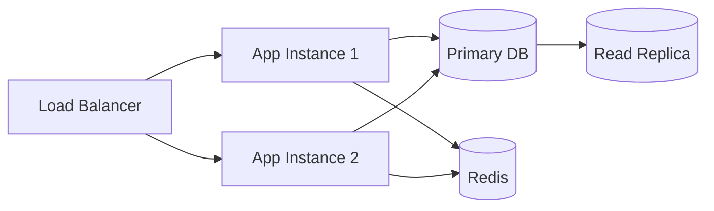

# Architecture

> **Template**: During actual usage, this file will be generated as
> `docs/architecture.md` in the target project directory by the
> documentation phase, derived from the actual codebase.

## Overview
{High-level description of the system architecture. Derived from spec.md design
decisions and actual code structure.}

## System Architecture Diagram



## Project Structure
```
src/
├── config/        — {what this contains}
├── types/         — {what this contains}
├── domain/        — {what this contains}
│   └── user/      — {what this contains}
├── infrastructure/ — {what this contains}
├── api/           — {what this contains}
└── utils/         — {what this contains}
```

## Architecture Decisions

{Key decisions made during brainstorm/planning and how they're reflected in code.}

### {Decision 1: e.g., "Layered Architecture"}
**Decision:** {what was decided}
**Rationale:** {why — from design doc}
**Implementation:** {how it's reflected in code structure}

### {Decision 2: e.g., "PostgreSQL over MongoDB"}
**Decision:** {what was decided}
**Rationale:** {why}
**Implementation:** {how}

## Request Lifecycle — Sequence Diagram



## Data Flow

{How a request flows through the system — from HTTP to response.
Trace an actual endpoint through the layers.}

1. Request arrives at `src/api/routes/{resource}.routes.ts`
2. Middleware validates auth (`src/api/middleware/auth.ts`)
3. Handler calls service (`src/domain/{resource}/{resource}.service.ts`)
4. Service calls repository (`src/domain/{resource}/{resource}.repository.ts`)
5. Repository executes query (`src/infrastructure/database/...`)
6. Response serialized and returned

## Error Handling Flow



## Database Schema

{If database exists — ER diagram or table descriptions from actual schema/migrations.}



## State Machine Diagram

{If the system has entities with lifecycle states.}



## External Dependencies

{External services, APIs, databases the system connects to.}

| Dependency | Purpose | Config |
|-----------|---------|--------|
| PostgreSQL | Primary data store | `DATABASE_URL` |
| Redis | Caching/sessions | `REDIS_URL` |

## Security Model

{How authentication and authorization work. Derived from actual middleware and
auth implementation.}

## Deployment Architecture


